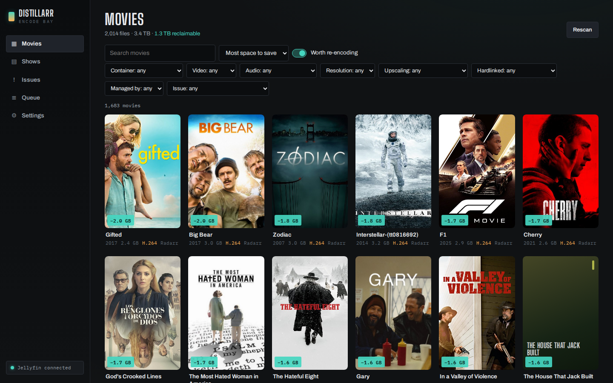
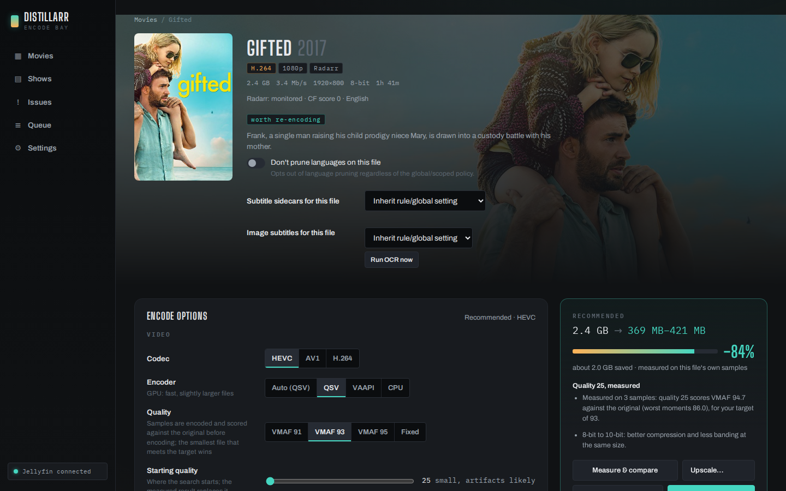
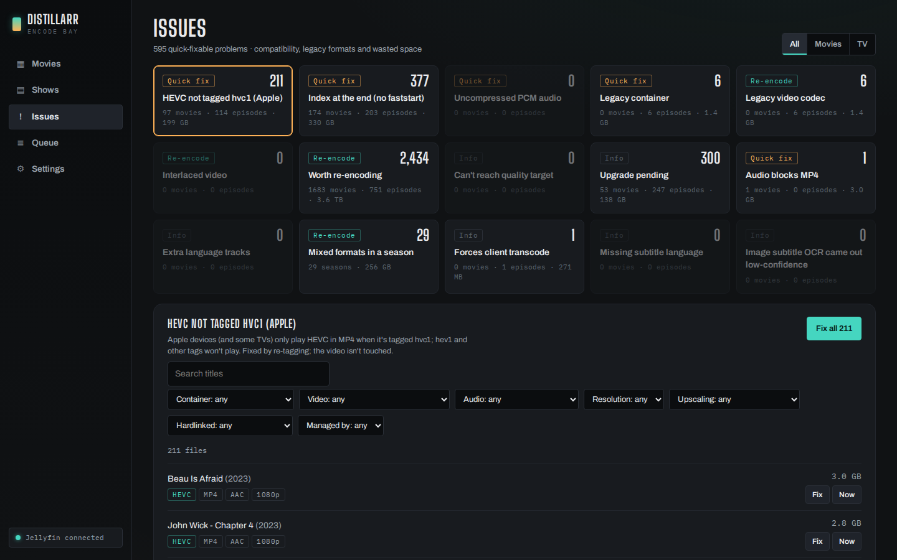
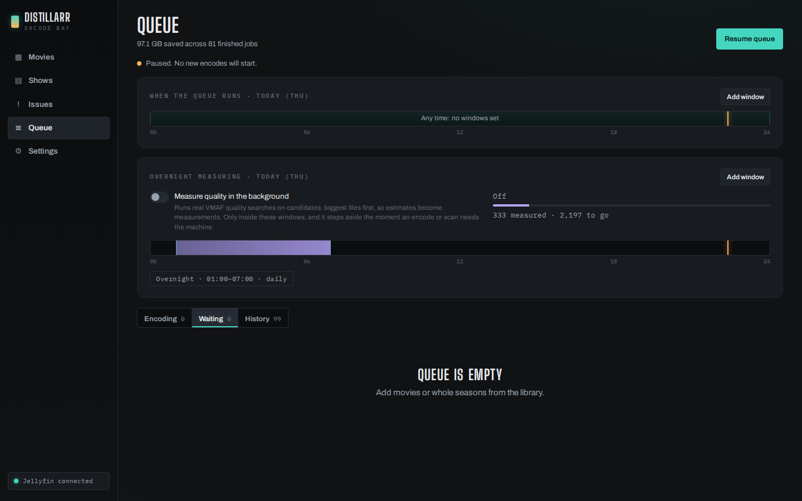
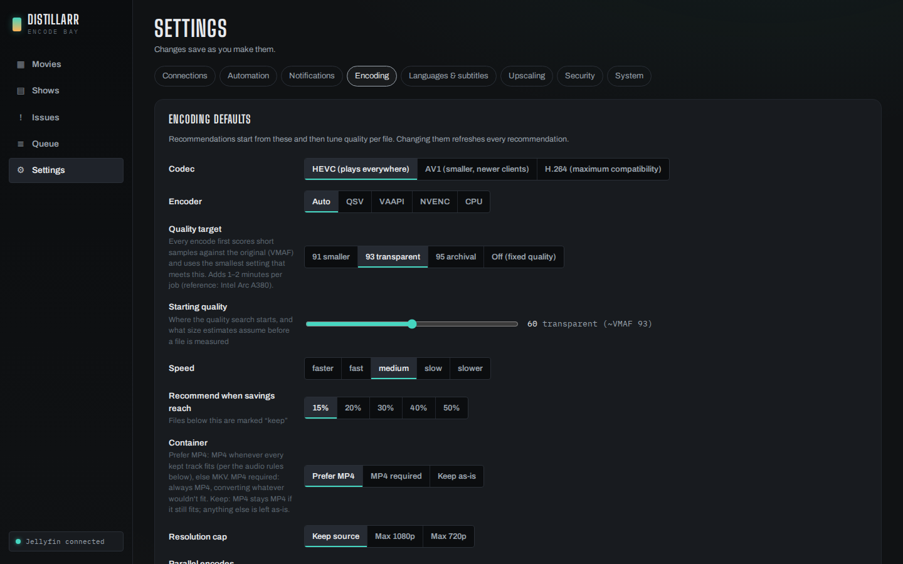

# Distillarr

Distillarr finds the files in your media library that would shrink or play
better, and re-encodes them (HEVC, AV1 or H.264) on your GPU or CPU. It
checks every result against the original before it replaces anything, and
it works with Sonarr, Radarr, Jellyfin, Plex and Bazarr.



## What it does

- **Scans your library** and recommends, per file, whether a re-encode is
  worth it and roughly how much it saves. Estimates improve as it measures
  real encodes on your hardware.
- **Finds problems** that make files play badly: HEVC that Apple devices
  won't play (`hev1` instead of `hvc1`), MP4 index at the end, legacy
  containers and codecs, uncompressed PCM audio, audio that forces MKV,
  mixed formats in a season, extra language tracks, missing subtitles, and
  files that forced a client to transcode. Quick fixes remux in minutes
  without touching the video.
- **Encodes to a quality target**, not a fixed setting: short samples are
  scored against the original with VMAF and the smallest setting that
  meets your target is used.
- **Runs when you say**: processing windows (e.g. nightly), pause/resume,
  a per-window budget for automatic queueing, and it can wait while
  someone is streaming.
- **Replaces safely**: see [Safety](#safety).
- **Automates**: rules that queue new downloads from Sonarr/Radarr
  webhooks after a settle delay, or work through the backlog within a
  budget, highest savings first.
- **Tracks and subtitles**: audio conversion rules per codec (e.g. TrueHD
  to E-AC-3 for MP4), language pruning with a dry-run report, subtitle
  sidecar extraction, and optional OCR of image subtitles.
- **Upscales** older sources with GPU shaders (Vulkan/libplacebo, near
  realtime) or neural models (Real-ESRGAN, hours per file, runs overnight).
- **Reports**: notifications (Discord, ntfy, Telegram, email and about 20
  more), a nightly summary, Prometheus `/metrics`, and library trends.

What it doesn't do: download anything, manage your library layout, or
touch files you haven't queued (automation is off until you turn it on).

| | |
|---|---|
|  |  |
|  |  |

## Quick start

```yaml
# docker-compose.yml: Intel GPU example; see examples/ for AMD, NVIDIA, CPU-only
services:
  distillarr:
    image: ghcr.io/creaturesurvive/distillarr:latest
    container_name: distillarr
    restart: unless-stopped
    ports:
      - "8093:8080"
    environment:
      PUID: "1000"
      PGID: "1000"
      TZ: Europe/London
    group_add:
      - "993" # your host's `render` group: getent group render | cut -d: -f3
    devices:
      - /dev/dri:/dev/dri
    volumes:
      - ./config:/config
      - /path/to/media:/media
```

```sh
docker compose up -d
```

Open `http://<host>:8093`. From your local network you'll be asked to
create the admin account, then a setup wizard walks you through picking
library folders, the hardware probe, encoding defaults and the processing
window. **The queue starts paused**: look at the recommendations, try an
A/B preview or two, then resume it from the Queue page.

Mount your media at the same path your other apps use if you can (e.g.
`/data` like Sonarr/Radarr). Otherwise set a path mapping for each
integration in Settings → Connections.

More: [examples/](examples/) (compose files per GPU vendor and an Unraid
template), [docs/packaging.md](docs/packaging.md) (users, groups, GPUs,
Vulkan), [docs/configuration.md](docs/configuration.md) (every setting),
[docs/faq.md](docs/faq.md).

## Safety

Distillarr is built to never lose a file:

- **Verification before replacement.** Every output is probed and checked
  for duration, stream counts, codec and pixel format, a size floor, a
  decode spot check mid-file, MP4 tagging and index position, and (for
  upscales) exact size and colour. A file that fails is discarded; the
  original is untouched.
- **Crash-safe replace.** The encode is written to a hidden temp file
  next to the original and flushed to disk. The original is hardlinked
  into a trash folder *before* the rename, then the new file takes its
  place with the original's timestamps and permissions.
- **Trash with retention.** Originals stay in the trash for 14 days by
  default, with one-click restore. The trash sits on the same filesystem
  as each library so keeping an original costs no copy; if that isn't
  possible, the job fails with an explanation rather than copying
  gigabytes behind your back.
- **Paused first run.** Nothing runs until you resume the queue.
- **Hardlink confirmation.** Replacing a file that's hardlinked (e.g.
  still seeding in your torrent client) frees no space, so Distillarr asks
  first.
- **Upgrade-loop protection.** If Sonarr/Radarr replaces a file soon after
  it was re-encoded, the new file is skipped and you're told why.

## Integrations

All optional. Settings → Connections.

- **Sonarr / Radarr** (any number of instances): skip files an upgrade is
  coming for, steer files with tags (`mt-skip`, `mt-av1`, `mt-hevc`,
  `mt-remux-only`), rescan after a replace, optional tagging/unmonitoring,
  and webhooks that queue new imports. See the FAQ on codec penalties
  before letting them grab re-encoded releases.
- **Jellyfin / Plex**: posters and metadata, refresh after a replace,
  keep "date added", don't encode while someone is transcoding, don't swap
  a file while it's being watched, flag files that force transcodes.
- **Bazarr**: rescan subtitles after a replace, search for missing ones.
- **Authelia / Authentik**: trust their username header (Settings →
  Security), or use LAN bypass on a home network.

## Hardware

Encoders are found by testing, not assumed: Intel QSV and VA-API, AMD
VA-API, NVIDIA NVENC, and software (x265, SVT-AV1, x264). Only encoders
that pass a real test encode are used, per GPU. Upscaling needs a working
Vulkan driver (Mesa for Intel/AMD, the NVIDIA driver for NVIDIA). Speed
estimates start from reference figures measured on an Intel Arc A380 and
switch to measurements from your own hardware after a few runs.

## Development

Go backend (`internal/`), React + Vite UI (`web/`, embedded in the
binary), ffmpeg (jellyfin-ffmpeg in the image). Tooling runs in Docker:

```sh
docker run --rm -v $PWD:/src -w /src golang:1.25-bookworm go test -buildvcs=false ./...
(cd web && npm ci && npx tsc --noEmit -p . && npm run dev)   # dev UI proxies /api to :8080
DISTILLARR_DB=/tmp/dev.db go run .
docker build -t distillarr .
```

CI runs the same steps (`.github/workflows/ci.yml`).

## Licence

GPL-3.0-or-later; see [LICENSE](LICENSE). Vendored upscaling shaders keep
their own licences in `internal/upscale/shaders/` (Anime4K and AMD FSR:
MIT; FSRCNNX: LGPL-3.0, stated in each file's header). ffmpeg and the
encoder libraries in the image are separate programs under their own
licences.
